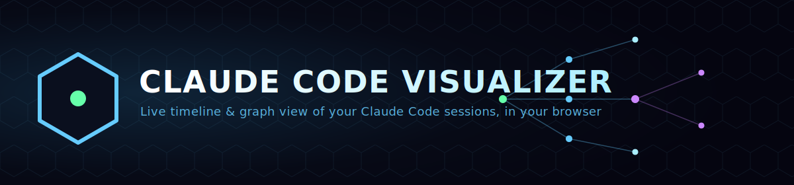
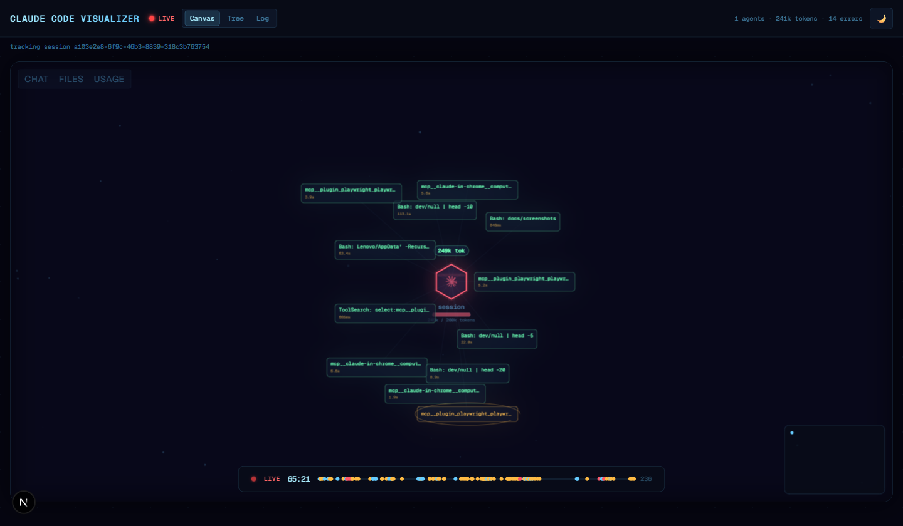
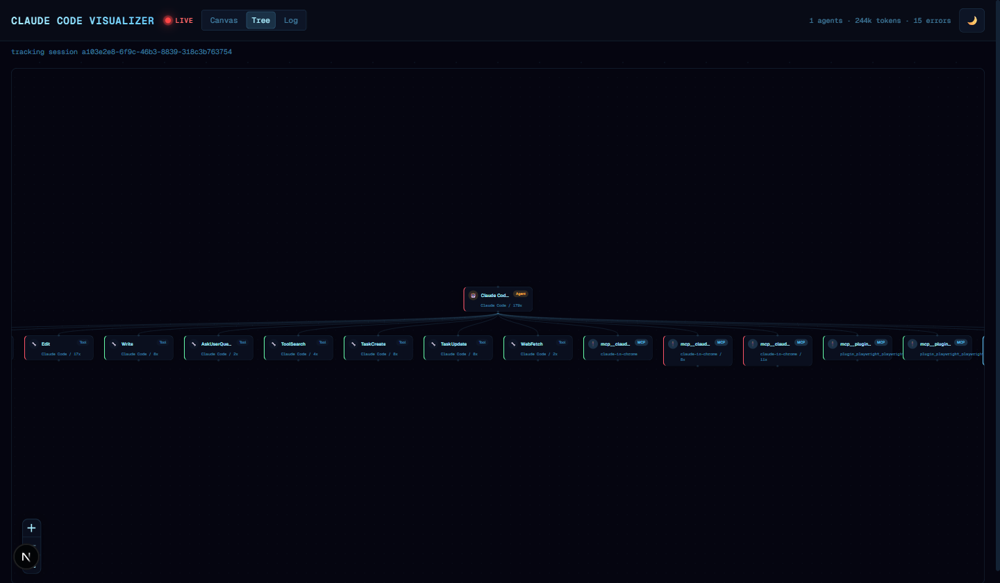
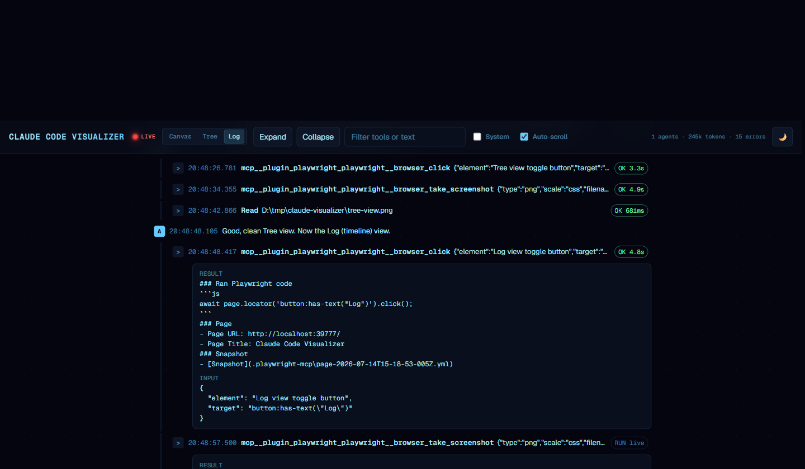

<p align="center">
  
</p>

<p align="center">
  <a href="https://www.npmjs.com/package/@vignesheakanathan/claude-visualizer"></a>
  <a href="./LICENSE"></a>
  
</p>

A live, in-browser view of a [Claude Code](https://claude.com/claude-code) session — timeline, tool calls, subagent
dispatches, and cost, updating as the session runs. Claude Code already writes a complete transcript of every
session to disk as JSONL; this reads that file directly, so there's no hook or setting to configure.

> **Scope:** this project is built specifically for Claude Code's own transcript format
> (`~/.claude/projects/**/*.jsonl`). It doesn't support other agent frameworks or CLIs.

## Screenshots

| Canvas | Tree | Log |
| --- | --- | --- |
|  |  |  |

- **Canvas** — an animated satellite view: the active turn pulses at the center, tool calls orbit around it as they
  happen, with a live status bar and elapsed-time strip along the bottom.
- **Tree** — every tool grouped and counted (e.g. `Edit · 17x`), so you can see at a glance what a session spent its
  time doing.
- **Log** — the classic vertical timeline: expandable turns, tool calls with duration/success/error, filterable by
  text.

## Features

- **Live** — tails the transcript over Server-Sent Events; new turns, tool calls, and subagent dispatches appear
  within seconds, no refresh.
- **Subagent-aware** — a dispatched subagent's own transcript nests inside the turn that spawned it.
- **Multiple sessions** — switch between concurrently active sessions with tabs.
- **Light/dark theme**, filtering, expand/collapse, and a running token/error count.
- Nothing leaves your machine — it's a local dev server reading a local file.

## Install & run

Requires [Node.js](https://nodejs.org/) 18 or later.

### Windows (PowerShell)

```powershell
npm install -g @vignesheakanathan/claude-visualizer
cd path\to\your\project      # the directory you run Claude Code from
claude-visualizer
```

### macOS (Terminal)

```bash
npm install -g @vignesheakanathan/claude-visualizer
cd path/to/your/project      # the directory you run Claude Code from
claude-visualizer
```

Then open the URL it prints (`http://localhost:3000` by default). The first run installs the bundled web app's
dependencies automatically — that can take a minute; every run after that starts immediately.

`claude-visualizer` auto-detects the most recently modified transcript for the current directory. To point it at a
specific file instead:

```powershell
# Windows
$env:TRANSCRIPT_PATH="C:\Users\you\.claude\projects\...\session.jsonl"; claude-visualizer
```

```bash
# macOS/Linux
TRANSCRIPT_PATH=~/.claude/projects/.../session.jsonl claude-visualizer
```

Pass `--port 3100` (or any port) if 3000 is already taken.

## Verify it's working

1. Run `claude-visualizer` from a directory where you have an active or recent Claude Code session.
2. Open the printed URL — you should see the **LIVE** indicator in the top-left turn green, and the session's
   existing history rendered in the Canvas view.
3. Switch to a Claude Code session in that same directory and send it a prompt that triggers a tool call.
4. Watch the browser tab — the new turn and tool call should appear within a couple of seconds, with no page
   reload.

If step 2 shows "waiting for events..." for longer than a few seconds, your current directory likely doesn't match
where the Claude Code session was started — pass `TRANSCRIPT_PATH` explicitly (see above).

## Contributing

Contributions are welcome — see [CONTRIBUTING.md](./CONTRIBUTING.md) for local setup and the PR process.

## License

MIT — see [LICENSE](./LICENSE). A few rendering techniques in the Canvas view are ported from a third-party
Apache-2.0-licensed project; see [THIRD_PARTY_NOTICES.md](./THIRD_PARTY_NOTICES.md) for details.
